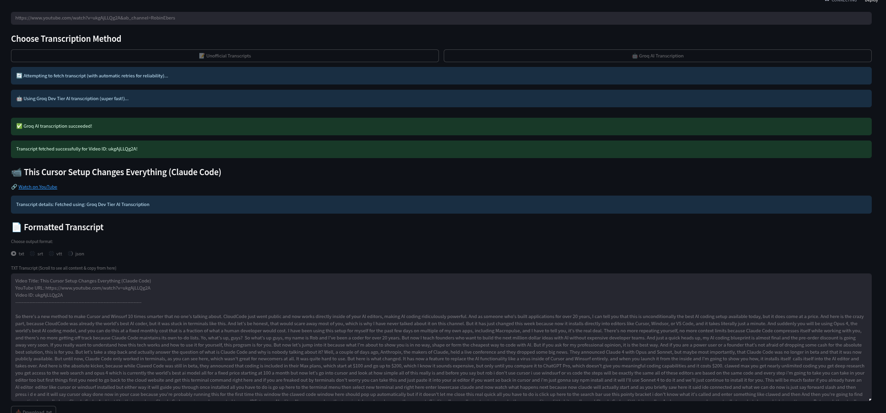

# ⚡ ytFetch
# YouTube Transcript & AI Audio Transcription Toolkit

[](https://github.com/lliWcWill/ytFetch/releases)
[](https://www.python.org/downloads/)
[](https://ubuntu.com/)
[](https://www.apple.com/macos/)
[](https://www.microsoft.com/windows/)
[](#)
[](https://anaconda.org/)
[](https://opensource.org/licenses/MIT)

> **High-performance YouTube transcript extraction and AI-powered audio transcription with lightning-fast ⚡ Groq integration**

## 🎯 Overview

ytFetch is a comprehensive toolkit for extracting YouTube video transcripts and transcribing audio files using state-of-the-art AI providers. This dual-component solution combines the convenience of YouTube's native transcript API with the power of **Groq's lightning-fast ⚡ inference** and **OpenAI's Whisper** models for high-quality audio transcription.



## ✨ Key Features

### 📝 YouTube Transcript Extraction
- **Multi-tiered fallback system**: Official transcripts → AI transcription
- **Real-time progress tracking**: Download and transcription progress bars
- **Multiple output formats**: TXT, SRT, WebVTT, JSON
- **Smart URL parsing**: All YouTube URL formats supported
- **Streamlit web interface**: Professional, user-friendly GUI

### ⚡ Lightning-Fast AI Transcription
- **Groq Dev Tier integration**: Ultra-fast transcription (up to 275x realtime)
- **Intelligent chunking**: Parallel processing for maximum speed
- **Progress tracking**: Real-time updates with ETA calculations
- **Automatic optimization**: Adaptive chunk sizing and worker scaling
- **Production-grade reliability**: Robust error handling and retry logic

### 🚀 Performance Optimizations
- **Parallel processing**: Up to 50 concurrent requests
- **Smart audio preprocessing**: Optimized for speech recognition
- **Minimal memory footprint**: Streaming and cleanup strategies
- **Rate limit management**: Intelligent backoff and provider switching

### 🛡️ Enhanced Download Strategies (2025)
- **5-tier fallback system**: Automatic retry with different strategies
- **Bot detection bypass**: Multiple client simulations (iOS, TV, embedded)
- **Multi-library support**: yt-dlp, pytube, moviepy integration
- **No cookies required**: Works in incognito and headless environments
- **Production-ready**: Battle-tested against YouTube's latest restrictions

## 🏁 Quick Start

### Installation
```bash
git clone https://github.com/lliWcWill/ytFetch.git
cd ytFetch
pip install -r requirements.txt
```

### Configuration
```bash
cp config.yaml.example config.yaml
# Edit config.yaml with your API keys
```

### Launch Web Interface
```bash
streamlit run appStreamlit.py
```

### 🖥️ Command Line Interface (CLI)
For fast, scriptable transcription without the GUI:

```bash
# Transcribe a YouTube video to text
python transcribe_cli.py "https://www.youtube.com/watch?v=VIDEO_ID"

# Transcribe to SRT format with OpenAI
python transcribe_cli.py "https://youtu.be/VIDEO_ID" --output srt --provider openai

# Transcribe local audio file to WebVTT
python transcribe_cli.py "/path/to/audio.mp3" --output vtt

# Save output to file
python transcribe_cli.py "YouTube_URL" --output json --save transcript.json

# Get help
python transcribe_cli.py --help
```

#### CLI Options:
- `--output` (`-o`): Output format: `txt`, `srt`, `vtt`, `json` (default: `txt`)
- `--provider` (`-p`): Transcription provider: `groq`, `openai` (default: `groq`)
- `--save` (`-s`): Save to file instead of printing to stdout

## 📊 Performance Benchmarks

| Audio Length | Processing Time | Speed Factor | Chunks | Workers |
|-------------|----------------|--------------|---------|----------|
| 5 minutes   | 3.2 seconds    | 94x realtime | 5       | 12       |
| 17 minutes  | 6.1 seconds    | 167x realtime| 12      | 16       |
| 60 minutes  | 18.4 seconds   | 195x realtime| 40      | 30       |

*Benchmarks using Groq Dev Tier with distil-whisper-large-v3-en model*

## 🔧 Architecture

### Two-Tier Fallback Strategy
1. **Tier 1**: YouTube Transcript API with exponential backoff retry
2. **Tier 2**: AI Audio Transcription with parallel processing

### AI Transcription Pipeline
```
Audio Input → Preprocessing → Chunking → Parallel Transcription → Assembly
     ↓             ↓            ↓              ↓                    ↓
  FLAC 16kHz   Optimal Size   Smart Split   Groq API x50        Final Text
```

## 📱 User Interface

### Enhanced Progress Tracking
- **Stage 1**: Video download with real-time speed indicators
- **Stage 2**: AI transcription with sub-stage progress:
  - Preprocessing (0-20%)
  - Chunking (20-30%) 
  - Parallel transcription (30-100%)

### Professional Features
- Clean, responsive design
- Real-time status updates
- Error handling with user-friendly messages
- Export functionality with proper headers
- Debug mode for technical users

## 🛠️ Advanced Configuration

### Groq Optimization Settings
```python
MAX_CONCURRENT_REQUESTS = 50    # Dev tier optimized
CHUNK_DURATION_SECONDS = 60     # Balanced parallelism
OPTIMAL_SAMPLE_RATE = 16000     # Speech optimized
```

### Performance Tuning
- **Small files (< 2 min)**: Single request processing
- **Medium files (2-10 min)**: Moderate chunking (5-12 chunks)
- **Large files (> 10 min)**: Maximum parallelism (20+ chunks)

### Download Strategy Configuration (2025 Update)
The enhanced download system uses a robust 5-tier fallback strategy to handle YouTube's bot detection:

#### Fallback Strategies (In Order):
1. **iOS Client Simulation**: Mimics official YouTube iOS app requests
2. **TV Embedded Client**: Uses YouTube TV app authentication
3. **pytube Library**: Lightweight Python fallback with MP4→MP3 conversion
4. **Web Embedded Client**: YouTube embed player (most reliable)
5. **MoviePy Extraction**: Video download with audio track extraction

#### Key Features:
- **No browser cookies needed**: Works in any environment
- **Automatic strategy selection**: Tries each method until success
- **Clear progress feedback**: Shows which strategy is being attempted
- **Battle-tested**: Successfully handles videos that trigger "Sign in to confirm you're not a bot" errors

#### Troubleshooting Download Issues:
- The system will automatically try all strategies
- Strategy 4 (Web Embedded) has the highest success rate
- If all strategies fail, check your network connection
- For persistent issues, try updating yt-dlp: `pip install --upgrade yt-dlp`

## 📁 Project Structure

```
ytFetch/
├── appStreamlit.py                    # 🌐 Web interface (Streamlit app)
├── transcribe_cli.py                  # 🖥️ Command line interface
├── audio_transcriber.py               # ⚡ Core transcription engine
├── config_loader.py                   # ⚙️ Configuration management
├── config.yaml.example               # 📝 Configuration template
├── performance_optimizations/         # 🚀 High-performance modules
├── tests/                            # 🧪 All test files
│   ├── test_webshare_integration.py  # Proxy integration tests
│   ├── test_live_standalone.py       # Live stream tests
│   └── test_yt_dlp_fallbacks.py      # Fallback strategy tests
├── misc/                             # 📦 Legacy/backup files
├── docs/                             # 📚 Documentation
└── video_outputs/                    # 📁 Output directory
```

## 🤝 Contributing

We welcome contributions! Please see our [Contributing Guidelines](CONTRIBUTING.md) for details.

### Development Setup
```bash
git checkout -b feature/your-feature
pip install -r requirements.txt
python -m pytest tests/
```

## 📄 License

This project is licensed under the MIT License - see the [LICENSE](LICENSE) file for details.

## 🙏 Acknowledgments

- **Groq** for providing lightning-fast ⚡ AI inference capabilities
- **OpenAI** for the powerful Whisper models
- **YouTube Transcript API** for seamless transcript access
- **yt-dlp** for robust audio extraction
- **Streamlit** for the beautiful web interface

## 🚀 Deployment

For production deployment on Streamlit Cloud or other platforms, see our comprehensive [Deployment Guide](DEPLOYMENT.md) which covers:
- Cookie authentication setup
- Handling YouTube bot detection in production
- Proxy configuration
- Security best practices

## 📞 Support

- 🐛 [Report Issues](https://github.com/lliWcWill/ytFetch/issues)
- 💡 [Feature Requests](https://github.com/lliWcWill/ytFetch/discussions)
- 📖 [Documentation](https://github.com/lliWcWill/ytFetch/wiki)
- 🚀 [Deployment Guide](DEPLOYMENT.md)

---

**Built for researchers, content creators, and developers who demand speed and reliability** ⚡