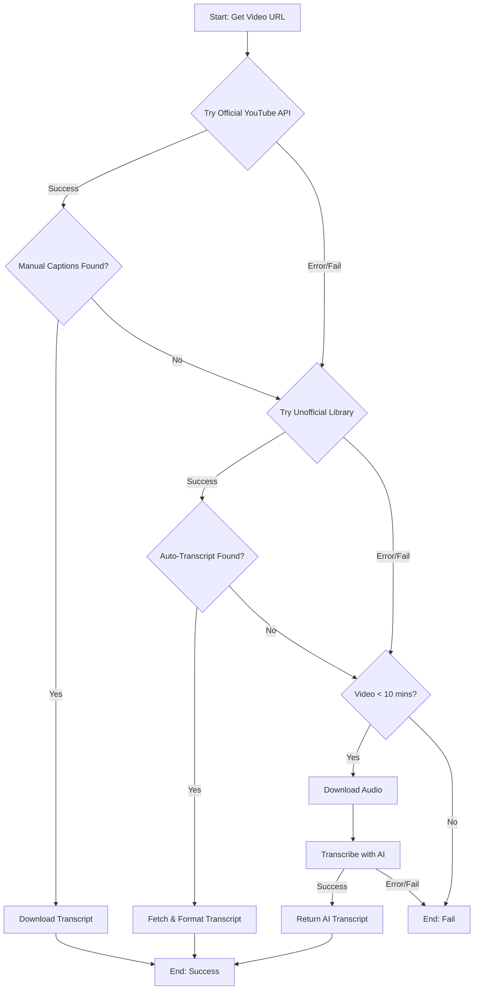
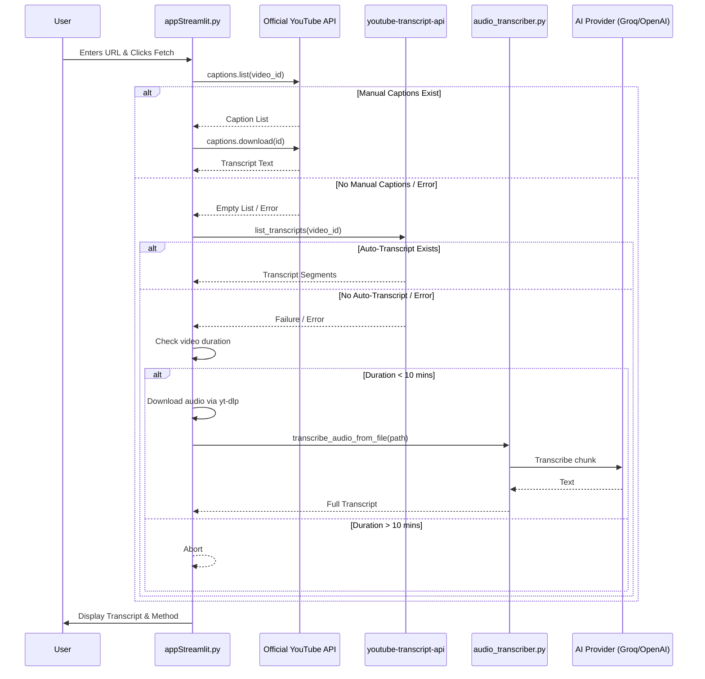

### New Project Memory Structure

```
.
├── CLAUDE.md         # The new, lean project memory hub
├── docs/
│   └── memory/
│       ├── architecture.md
│       └── coding_standards.md
└── ... (your other project files)
```

---

# System Architecture

The system uses a three-tiered fallback strategy to ensure the highest possible success rate for transcript retrieval.

## Tiered Fallback Logic

1.  **Tier 1: Official YouTube API (OAuth2)**
    *   **Method:** Authenticated calls using `google-api-python-client`.
    *   **Target:** High-quality, manually uploaded captions.
    *   **Trigger:** This tier is only attempted if the user has authenticated via the OAuth2 flow.

2.  **Tier 2: Unofficial Transcript Library**
    *   **Method:** The `youtube-transcript-api` library.
    *   **Target:** Auto-generated ASR transcripts.
    *   **Trigger:** This is the default for unauthenticated users or when Tier 1 fails (e.g., no manual captions found).

3.  **Tier 3: AI Audio Transcription**
    *   **Method:** Download audio via `yt-dlp` and process via `audio_transcriber.py` (using Groq/OpenAI).
    *   **Target:** Videos with all captions disabled.
    *   **Guardrail:** This tier is only attempted if the video duration is less than or equal to 10 minutes.

## Architectural Flowcharts

### High-Level Flow


### Sequence Diagram

