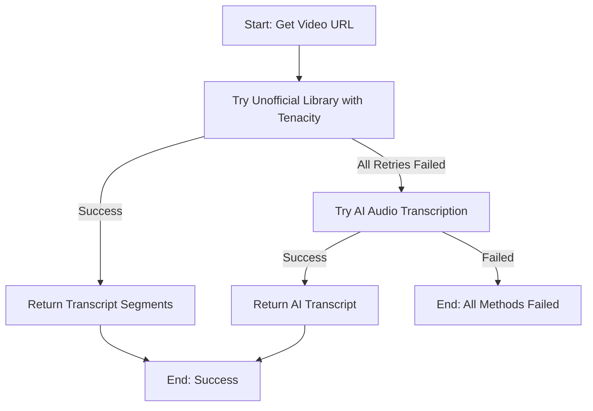
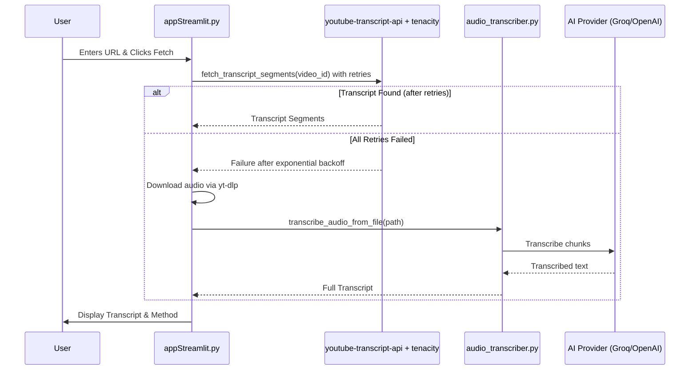

### New Project Memory Structure

```
.
├── CLAUDE.md         # The new, lean project memory hub
├── docs/
│   └── memory/
│       ├── architecture.md
│       └── coding_standards.md
└── ... (your other project files)
```

---

# System Architecture

The system uses a simplified two-tiered fallback strategy to ensure reliable transcript retrieval with production-grade robustness.

## Tiered Fallback Logic

1.  **Tier 1: Unofficial Transcript Library (Primary Method)**
    *   **Method:** The `youtube-transcript-api` library with `tenacity` for robust retry logic.
    *   **Target:** Auto-generated and manually created captions.
    *   **Robustness:** Production-grade retry handling with exponential backoff to handle intermittent XML parsing errors.

2.  **Tier 2: AI Audio Transcription (Last Resort)**
    *   **Method:** Download audio via `yt-dlp` and process via `audio_transcriber.py` (using Groq/OpenAI).
    *   **Target:** Videos with all captions disabled.
    *   **Scope:** No duration limits - handles videos of any length through intelligent chunking.

## Architectural Flowcharts

### High-Level Flow


### Sequence Diagram

